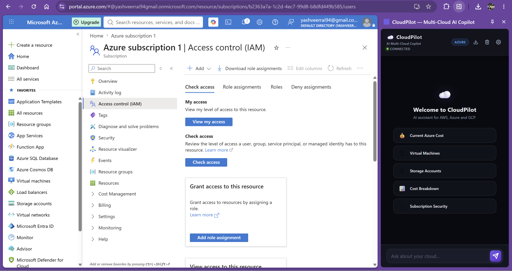
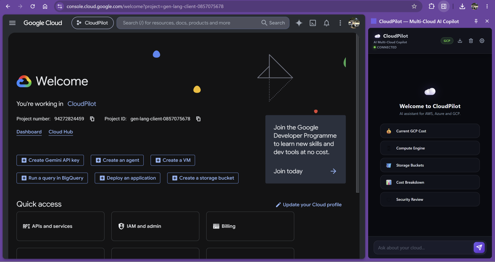

# CloudPilot — AI Multi-Cloud Copilot

> A context-aware Chrome Extension and FastAPI backend that integrates directly into AWS Console, Azure Portal, and GCP Console. Inspect compute resources, analyze storage security scopes, and retrieve cost summaries using natural language.

---

## 📸 Screenshots & Visual Walkthrough

### 1. AWS Console Integration & Resource Context Detection
Open the extension while viewing an Amazon EC2 instance or S3 bucket detail page. CloudPilot automatically detects the active AWS region, service, and resource ID, injecting it directly into the chat context.


*(Fig 1: CloudPilot detecting and auditing active EC2 instances on AWS)*


*(Fig 2: AI Cost Breakdown and recommendations for AWS billing)*

---

### 2. Azure Portal Integration & Context Mapping
Transition to portal.azure.com. The extension service worker instantly updates the provider badge and pulls Subscription IDs, Resource Groups, and Virtual Machine details from active URL hashes.


*(Fig 3: Auditing active Azure Virtual Machines)*


*(Fig 4: Reviewing security configurations of Azure Storage Accounts)*

---

### 3. GCP Console Integration & Graceful Error Handling
On Google Cloud Console, CloudPilot parses active project IDs, compute zones, and Cloud Storage bucket profiles, catching permission limits gracefully and displaying troubleshooting details.


*(Fig 5: Google Cloud Platform integration dashboard)*

---

## 🚀 Key Features

*   **⚡ Context-Aware Dialogues**: URL matching logic extracts resource details automatically, prepending them to prompts so you never have to type IDs manually.
*   **🧩 Multi-Cloud Adapter Pattern**: Standardizes different vendor structures (AWS Boto3, Azure SDKs, GCP Client libraries) into a normalized schema, ensuring high codebase modularity.
*   **🔮 Stateful ReAct Agent**: Employs LangGraph to coordinate reasoning and tool-calling loops, deciding dynamically when to execute queries.
*   **🟢 Health-Checking Status Dot**: Pings `/health` on a 15-second timer, showing a red/green status dot and disabling input areas if the backend is offline.
*   **⏳ Stepwise Progress Status**: Updates loading text (dots, "Still working...", "Large envs take longer...") based on active request durations.
*   **📁 Markdown Conversation Exporter**: Compiles and downloads sidepanel dialogues to local Markdown files.
*   **⚙️ Settings Panel**: Allows changing and persisting the backend API target address on the fly.

---

## 🛠 Tech Stack

*   **Extension (Frontend)**: HTML5 · CSS3 (Glassmorphic theme) · ES6 JavaScript · Chrome MV3 · Side Panel API
*   **Backend & API**: Python 3.12 · FastAPI · Uvicorn · Pydantic · python-dotenv
*   **AI Agent**: LangGraph · LangChain · Groq API (`llama-3.3-70b-versatile`)
*   **Cloud Integrations**: Boto3 (AWS) · Azure Management SDKs (Azure) · Google Cloud Python Clients (GCP)
*   **Deployment**: AWS EC2 · pm2

---

## 📐 System Architecture

```
                  ┌────────────────────────────────────────┐
                  │          Chrome Web Browser            │
                  │  ┌───────────────┐   ┌──────────────┐  │
                  │  │  Side Panel   │   │  Background  │  │
                  │  │  Chat (HTML/  │◄─►│   Worker     │  │
                  │  │  CSS/JS)      │   │  (context)   │  │
                  │  └───────┬───────┘   └──────────────┘  │
                  └──────────┼─────────────────────────────┘
                             │ HTTP POST /ask (JSON context)
                             ▼
                  ┌────────────────────────────────────────┐
                  │           FastAPI Backend              │
                  │  ┌───────────────┐   ┌──────────────┐  │
                  │  │  /ask Route   │◄─►│  LangGraph   │  │
                  │  └───────────────┘   │  Agent (LLM) │  │
                  │                      └──────┬───────┘  │
                  │                             │          │
                  │                      ┌──────▼───────┐  │
                  │                      │ Multi-Cloud  │  │
                  │                      │ │  Adapter   │  │
                  │                      └──────┬───────┘  │
                  └─────────────────────────────┼──────────┘
                                                ▼
                                         Cloud Provider APIs
                                         (AWS, Azure, GCP)
```

---

## 📝 Installation & Setup

### 1. Prerequisites
*   Python 3.12+
*   Google Chrome Browser
*   Groq API Key
*   Access keys for AWS, Azure, and GCP

### 2. Backend Installation
1.  Navigate to the `backend/` directory:
    ```bash
    cd backend
    ```
2.  Set up and activate a virtual environment:
    ```bash
    python -m venv venv
    # Windows:
    .\venv\Scripts\Activate.ps1
    # macOS/Linux:
    source venv/bin/activate
    ```
3.  Install dependencies:
    ```bash
    pip install -r requirements.txt
    ```
4.  Create a `.env` file from the reference template:
    ```bash
    cp .env.example .env
    ```
5.  Open `.env` and fill in your cloud credential variables (AWS Access Keys, Azure Tenant IDs, GCP Service Account path, and Groq API Key).
6.  Start the FastAPI server:
    ```bash
    uvicorn main:app --reload
    ```
    The server will start at `http://127.0.0.1:8000`.

### 3. Extension Installation
1.  Open Google Chrome and navigate to `chrome://extensions/`.
2.  Toggle on **Developer mode** in the top-right corner.
3.  Click **Load unpacked** in the top-left corner.
4.  Select the `cloudpilot/extension/` directory.
5.  Pin the **CloudPilot** extension to your toolbar. Click the icon to launch the sidebar panel!

---

## 🔒 Security Scoping
To maintain strict governance, all cloud credentials must be configured with read-only roles:
*   **AWS**: Attached only the `ReadOnlyAccess` managed policy.
*   **Azure**: Scoped as a `Reader` at the target subscription level.
*   **GCP**: Bound only to the `Viewer` role.

The application cannot write, create, edit, or delete any cloud infrastructure resources.
